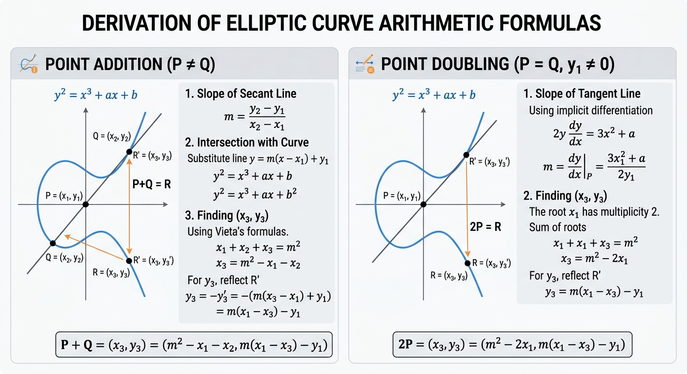

# ELLIPTIC CURVES & ELLIPTIC FUNCTIONS

## Part 2 — How to Add Points on a Curve: The Chord‑and‑Tangent Method

*Level: elementary. The figure makes its first appearance.*

*Series: [Part 1 — The Circle, the Ellipse, and the Birth of a New Trigonometry](elliptic_part1.md) · [Part 2 — How to Add Points on a Curve: The Chord‑and‑Tangent Method](elliptic_part2.md) · [Part 3 — Counting Points, Keeping Secrets: Elliptic Curves mod $p$](elliptic_part3.md) · [Part 4 — Rational Points and the Rank: The Mordell–Weil Theorem](elliptic_part4.md) · [Part 5 — The Torus, the $\wp$‑Function, and Modularity: The Grand Synthesis](elliptic_part5.md). One figure — the two‑panel derivation of the addition and doubling formulas — is reused throughout the series as a visual anchor.*

---

**1. The curve.** Over a field, an elliptic curve is given (after a change of variables) by
$$E:\ y^2=x^3+ax+b,$$
with the discriminant condition $\Delta=-16(4a^3+27b^2)\neq 0$, which guarantees no cusps or self‑intersections. [en.wikipedia](https://en.wikipedia.org/wiki/Elliptic_curve) A concrete example: $E: y^2=x^3-x$, where $4(-1)^3+27\cdot 0=-4\neq0$. Elliptic curves are studied over various fields: over $\mathbb Q$ (rational points and Diophantine equations) and over $\mathbb F_p$ (counting points mod $p$ and using those counts in number theory and crypto). [dummit.cos.northeastern](https://dummit.cos.northeastern.edu/docs/numthy_7_elliptic_curves.pdf)

**2. The surprise.** The points of $E$, together with a point at infinity $\mathcal O$, form an **abelian group**, and the addition law is geometric — the *chord‑and‑tangent method* depicted in the figure:

> **Figure.** *Left panel (addition, $P\neq Q$):* the secant through $P=(x_1,y_1)$ and $Q=(x_2,y_2)$ meets the curve in a third point $R'=(x_3,y_3')$; reflecting across the $x$‑axis gives $P+Q=R$. *Right panel (doubling, $P=Q$, $y_1\neq0$):* the tangent at $P$ meets the curve again in $R'$; reflecting gives $2P=R$. The boxed formulas at the bottom of the figure are the summary table of §5. [dummit.cos.northeastern](https://dummit.cos.northeastern.edu/docs/numthy_7_elliptic_curves.pdf)

**3. Addition, following the left panel.** The secant slope is $m=\frac{y_2-y_1}{x_2-x_1}$; the line is $y=m(x-x_1)+y_1$. Substituting into $y^2=x^3+ax+b$ and collecting terms yields a monic cubic in $x$ whose $x^2$‑coefficient is $-m^2$, having exactly $x_1,x_2,x_3$ as roots. Vieta's formula (sum of roots $=-c_2$) gives
$$x_1+x_2+x_3=m^2\ \Longrightarrow\ x_3=m^2-x_1-x_2 .$$
The third intersection has $y_3'=m(x_3-x_1)+y_1$; reflecting across the $x$‑axis:
$$y_3=-y_3'=m(x_1-x_3)-y_1 .$$
(If $x_1=x_2$ with $y_1=-y_2$, the chord is vertical and $P+Q=\mathcal O$.)

**4. Doubling, following the right panel.** Now the line is the tangent. Implicit differentiation of $y^2=x^3+ax+b$ gives $2y\,\frac{dy}{dx}=3x^2+a$, hence
$$m=\left.\frac{dy}{dx}\right|_{P}=\frac{3x_1^2+a}{2y_1}.$$
The tangency means $x_1$ is a *double* root, so Vieta reads $x_1+x_1+x_3=m^2$, i.e. $x_3=m^2-2x_1$, with the same reflection $y_3=m(x_1-x_3)-y_1$.

**5. Summary table** (the boxed formulas at the bottom of the figure):

| Operation | Slope $m$ | Output $(x_3,y_3)$ |
|---|---|---|
| Addition $P\neq Q$ | $\frac{y_2-y_1}{x_2-x_1}$ | $x_3=m^2-x_1-x_2$, $\ y_3=m(x_1-x_3)-y_1$ |
| Doubling $P=Q$ | $\frac{3x_1^2+a}{2y_1}$ | $x_3=m^2-2x_1$, $\ y_3=m(x_1-x_3)-y_1$ |

**6. A worked example over $\mathbb Q$.** On $E:y^2=x^3-x$, take $P=(0,0)$ (indeed $0^2=0^3-0$). The doubling slope would be $\frac{3\cdot0-1}{2\cdot0}=\frac{-1}{0}$, undefined: the tangent at $P$ is vertical, the "third intersection" is $\mathcal O$, and $2P=\mathcal O$. So $P$ has **order 2** — and the same holds for $(\pm1,0)$. This is already number theory: we are making group‑theoretic statements about *rational solutions of a cubic*.

**7. The same figure over a finite field.** Nothing in the figure's algebra required real numbers. Reduce $E:y^2=x^3+4x+4$ modulo $5$, and take $P_1=(1,3)$, $P_2=(0,2)$. Left panel, step by step, in $\mathbb F_5$:
$$m=\frac{2-3}{0-1}=\frac{-1}{-1}=1,\quad x_3=1-1-0=0,\quad y_3=1\cdot(1-0)-3=-2\equiv 3 .$$
So $P_1+P_2=(0,3)$ in $E(\mathbb F_5)$. [dummit.cos.northeastern](https://dummit.cos.northeastern.edu/docs/numthy_7_elliptic_curves.pdf) The picture of chords and reflections was drawn over $\mathbb R$, but the *formulas* are field‑independent — a fact we exploit in [Part 3](elliptic_part3.md), and whose deepest explanation arrives only in [Part 5](elliptic_part5.md).

---

## The algebra behind the left panel, in full

To add two points $P=(x_1,y_1)$, $Q=(x_2,y_2)$ with $P\neq Q$ on $E:y^2=x^3+ax+b$:

**Step 1 — the secant.** The slope of the line through $P$ and $Q$ is
$$m = \frac{y_2 - y_1}{x_2 - x_1},$$
and the equation of the line is $y = m(x - x_1) + y_1$.

**Step 2 — substitute into the curve.** Substituting the line into $y^2 = x^3 + ax + b$ gives
$$(m(x - x_1) + y_1)^2 = x^3 + ax + b,$$
and expanding and rearranging into standard cubic form:
$$x^3 - m^2 x^2 + (a - 2m^2 x_1 + 2m y_1)x + (b - m^2 x_1^2 + 2m x_1 y_1 - y_1^2) = 0.$$

**Step 3 — Vieta.** By Vieta's formulas, the sum of the roots of the monic cubic $x^3 + c_2 x^2 + c_1 x + c_0 = 0$ equals $-c_2$. Since $x_1, x_2, x_3$ are the three roots,
$$x_1 + x_2 + x_3 = m^2 \implies x_3 = m^2 - x_1 - x_2.$$
The $y$-coordinate on the secant line is $y_3' = m(x_3 - x_1) + y_1$; reflecting across the $x$-axis gives $y_3 = -y_3'$:
$$y_3 = m(x_1 - x_3) - y_1.$$

**Doubling, in the same steps.** When $P=Q$ (with $y_1 \neq 0$) the line is the tangent at $P$. Implicit differentiation of $y^2 = x^3 + ax + b$ gives
$$2y \frac{dy}{dx} = 3x^2 + a \implies m = \frac{3x_1^2 + a}{2y_1}.$$
The root $x_1$ now has multiplicity 2, so Vieta reads
$$x_1 + x_1 + x_3 = m^2 \implies x_3 = m^2 - 2x_1,$$
with the same reflection $y_3 = m(x_1 - x_3) - y_1$.

Two edge cases complete the law: if $P=-Q$ (same $x$, opposite $y$), the chord is vertical and $P+Q=\mathcal O$; if $y_1=0$, the tangent is vertical and $2P=\mathcal O$ — exactly what made $(0,0)$ and $(\pm1,0)$ order‑2 points in §6.

---

*Next:* [Part 3 — Counting Points, Keeping Secrets: Elliptic Curves mod $p$](elliptic_part3.md), where the same two formulas become modular arithmetic and carry a cryptographic payload.

*References for the curious reader: Wikipedia articles on elliptic curves and elliptic functions; E. Dummit's notes on elliptic curves (Northeastern); the LMFDB database; SageMath documentation on elliptic curves; introductory handouts on elliptic functions (HSE, Leiden, Harvard, UCSB).*
